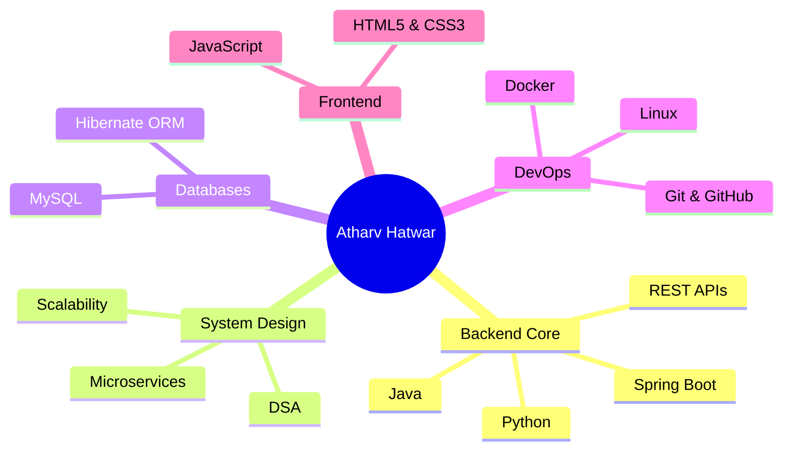
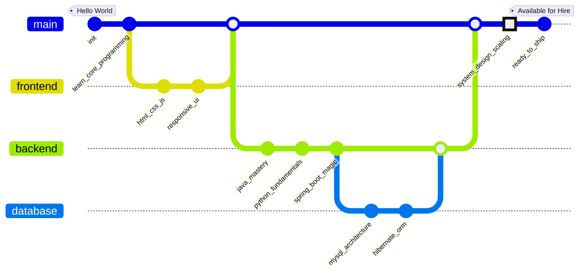
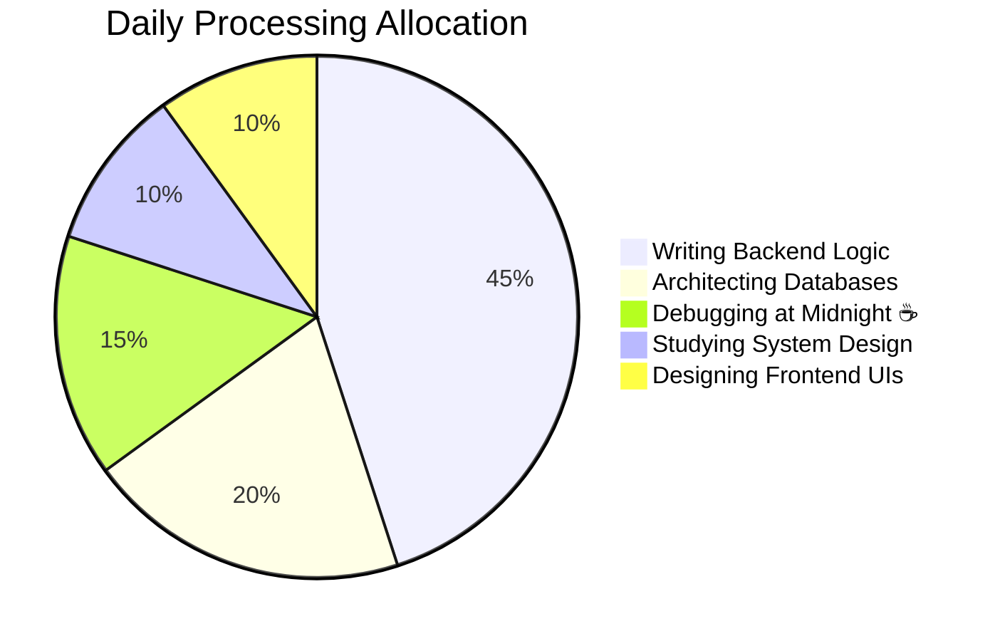

<h1 align="center">
  
</h1>

  <b>Full Stack Engineer</b> • <b>Java Architect</b> • <b>System Design Enthusiast</b> 
  <i>Pune, India</i>

  
  
  

---

## 🧠 Brain Architecture (Interactive Mindmap)
> *Pro Tip: This is a native Mermaid.js diagram! You can click, pan, and zoom to explore my tech stack.*

## 🛤️ Evolution of a Developer (GitGraph)
> *My coding journey, mapped out as a literal Git branch history.*

## ⏱️ Time Allocation Matrix
> *Where my processing power goes on a daily basis.*

---

## 📊 Live Telemetry

  
  

 

  

